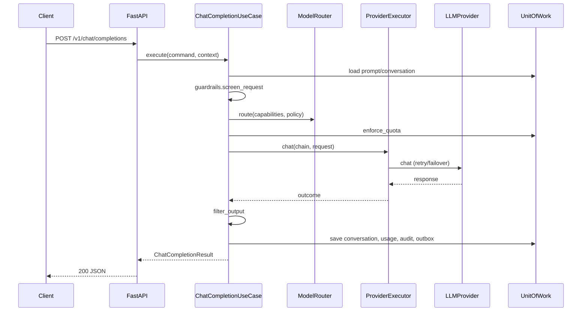
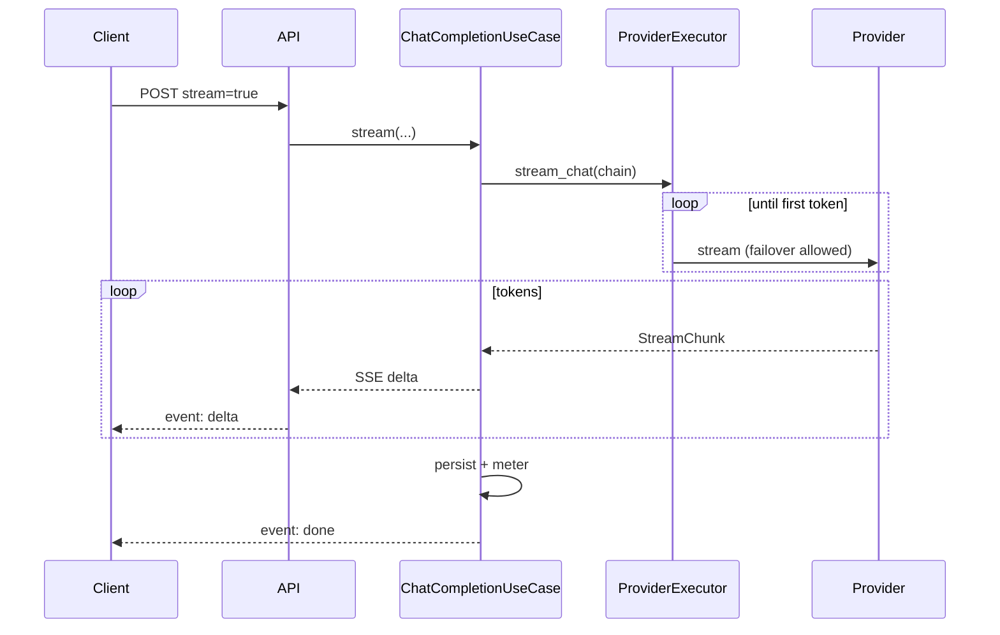
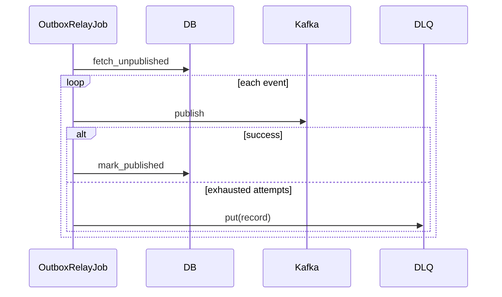

# Sequence diagrams

## Chat completion

```mermaid
sequenceDiagram
    participant Client
    participant API as FastAPI
    participant UC as ChatCompletionUseCase
    participant Router as ModelRouter
    participant Exec as ProviderExecutor
    participant Provider as LLMProvider
    participant DB as UnitOfWork

    Client->>API: POST /v1/chat/completions
    API->>UC: execute(command, context)
    UC->>DB: load prompt/conversation
    UC->>UC: guardrails.screen_request
    UC->>Router: route(capabilities, policy)
    UC->>DB: enforce_quota
    UC->>Exec: chat(chain, request)
    Exec->>Provider: chat (retry/failover)
    Provider-->>Exec: response
    Exec-->>UC: outcome
    UC->>UC: filter_output
    UC->>DB: save conversation, usage, audit, outbox
    UC-->>API: ChatCompletionResult
    API-->>Client: 200 JSON
```

## Streaming

```mermaid
sequenceDiagram
    participant Client
    participant API
    participant UC as ChatCompletionUseCase
    participant Exec as ProviderExecutor
    participant Provider

    Client->>API: POST stream=true
    API->>UC: stream(...)
    UC->>Exec: stream_chat(chain)
    loop until first token
        Exec->>Provider: stream (failover allowed)
    end
    loop tokens
        Provider-->>UC: StreamChunk
        UC-->>API: SSE delta
        API-->>Client: event: delta
    end
    UC->>UC: persist + meter
    UC-->>Client: event: done
```

## Outbox relay

```mermaid
sequenceDiagram
    participant Worker as OutboxRelayJob
    participant DB
    participant Kafka
    participant DLQ

    Worker->>DB: fetch_unpublished
    loop each event
        Worker->>Kafka: publish
        alt success
            Worker->>DB: mark_published
        else exhausted attempts
            Worker->>DLQ: put(record)
        end
    end
```
